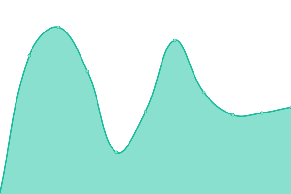
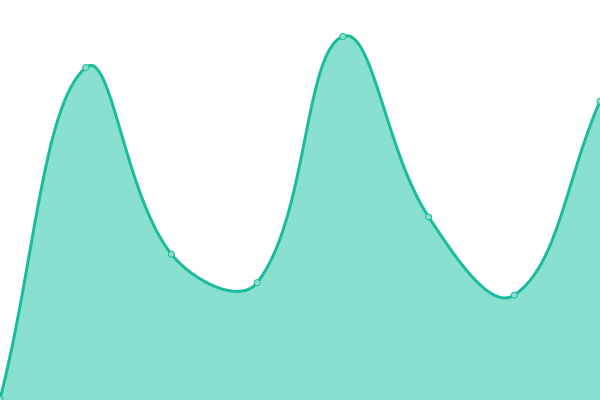
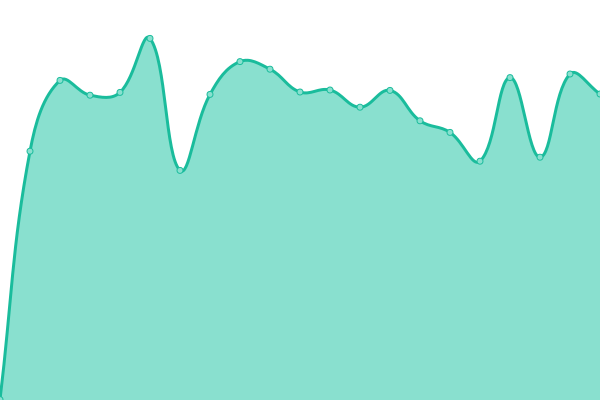

# [📈 Live Status](https://uptime.fxtalk.cn): <!--live status--> **🟧 Partial outage**

This repository contains the open-source uptime monitor and status page for [Felix](https://uptime.fxtalk.cn), powered by [Upptime](https://github.com/upptime/upptime).

With [Upptime](https://upptime.js.org), you can get your own unlimited and free uptime monitor and status page, powered entirely by a GitHub repository. We use [Issues](https://github.com/lazyyz/uptime/issues) as incident reports, [Actions](https://github.com/lazyyz/uptime/actions) as uptime monitors, and [Pages](https://uptime.fxtalk.cn) for the status page.

<!--start: status pages-->
<!-- This summary is generated by Upptime (https://github.com/upptime/upptime) -->
<!-- Do not edit this manually, your changes will be overwritten -->
<!-- prettier-ignore -->
| URL | Status | History | Response Time | Uptime |
| --- | ------ | ------- | ------------- | ------ |
|  [fxtalk](https://www.fxtalk.cn) | 🟥 Down | [fxtalk.yml](https://github.com/lazyyz/uptime/commits/master/history/fxtalk.yml) | 

 1473ms
     
 | 

<a href="https://uptime.fxtalk.cn/history/fxtalk">79.87%</a>
    

|  [LOVE](https://love.fxtalk.cn) | 🟥 Down | [love.yml](https://github.com/lazyyz/uptime/commits/master/history/love.yml) | 

 1106ms
     
 | 

<a href="https://uptime.fxtalk.cn/history/love">80.41%</a>
    

|  [Fun](https://fun.fxtalk.cn) | 🟥 Down | [fun.yml](https://github.com/lazyyz/uptime/commits/master/history/fun.yml) | 

 1230ms
     
 | 

<a href="https://uptime.fxtalk.cn/history/fun">80.42%</a>
    

|  [CIHU](https://www.cihucm.com) | 🟩 Up | [cihu.yml](https://github.com/lazyyz/uptime/commits/master/history/cihu.yml) | 

 1277ms
     
 | 

<a href="https://uptime.fxtalk.cn/history/cihu">100.00%</a>
    

|  [SP](https://www.shenpei.net) | 🟩 Up | [sp.yml](https://github.com/lazyyz/uptime/commits/master/history/sp.yml) | 

 884ms
     
 | 

<a href="https://uptime.fxtalk.cn/history/sp">99.79%</a>
    

|  [YQ](https://www.yqjf68.com) | 🟩 Up | [yq.yml](https://github.com/lazyyz/uptime/commits/master/history/yq.yml) | 

 765ms
     
 | 

<a href="https://uptime.fxtalk.cn/history/yq">100.00%</a>
    

<!--end: status pages-->

[**Visit our status website →**](https://uptime.fxtalk.cn)

## 📄 License

- Code: [MIT](./LICENSE) © [Felix](https://uptime.fxtalk.cn)
- Data in the `./history` directory: [Open Database License](https://opendatacommons.org/licenses/odbl/1-0/)
