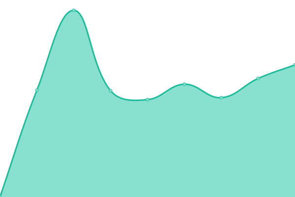

# [📈 Live Status](https://uptime.fxtalk.cn): <!--live status--> **🟩 All systems operational**

This repository contains the open-source uptime monitor and status page for [Felix](https://uptime.fxtalk.cn), powered by [Upptime](https://github.com/upptime/upptime).

With [Upptime](https://upptime.js.org), you can get your own unlimited and free uptime monitor and status page, powered entirely by a GitHub repository. We use [Issues](https://github.com/lazyyz/uptime/issues) as incident reports, [Actions](https://github.com/lazyyz/uptime/actions) as uptime monitors, and [Pages](https://uptime.fxtalk.cn) for the status page.

<!--start: status pages-->
<!-- This summary is generated by Upptime (https://github.com/upptime/upptime) -->
<!-- Do not edit this manually, your changes will be overwritten -->

| URL                             | Status | History                                                                          | Response Time                                                               | Uptime                                                                                                                                                                                           |
| ------------------------------- | ------ | -------------------------------------------------------------------------------- | --------------------------------------------------------------------------- | ------------------------------------------------------------------------------------------------------------------------------------------------------------------------------------------------ |
| [fxtalk](https://www.fxtalk.cn) | 🟩 Up  | [fxtalk.yml](https://github.com/lazyyz/uptime/commits/master/history/fxtalk.yml) |  978ms |  |
| [LOVE](https://love.fxtalk.cn)  | 🟩 Up  | [love.yml](https://github.com/lazyyz/uptime/commits/master/history/love.yml)     |  600ms   |      |
| [Fun](https://fun.fxtalk.cn)    | 🟩 Up  | [fun.yml](https://github.com/lazyyz/uptime/commits/master/history/fun.yml)       |  660ms    |        |
| [CIHU](https://www.cihucm.com)  | 🟩 Up  | [cihu.yml](https://github.com/lazyyz/uptime/commits/master/history/cihu.yml)     |  1115ms  |     |
| [SP](https://www.shenpei.net)   | 🟩 Up  | [sp.yml](https://github.com/lazyyz/uptime/commits/master/history/sp.yml)         |  719ms     |         |
| [YQ](https://www.yqjf68.com)    | 🟩 Up  | [yq.yml](https://github.com/lazyyz/uptime/commits/master/history/yq.yml)         |  1058ms    |         |

<!--end: status pages-->

[**Visit our status website →**](https://uptime.fxtalk.cn)

## 📄 License

- Code: [MIT](./LICENSE) © [Felix](https://uptime.fxtalk.cn)
- Data in the `./history` directory: [Open Database License](https://opendatacommons.org/licenses/odbl/1-0/)
